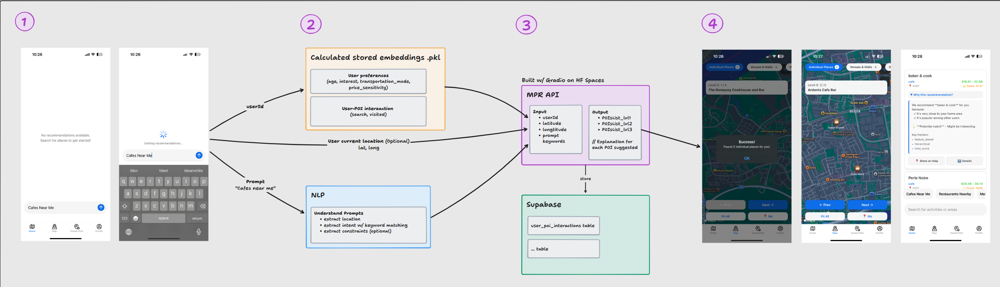
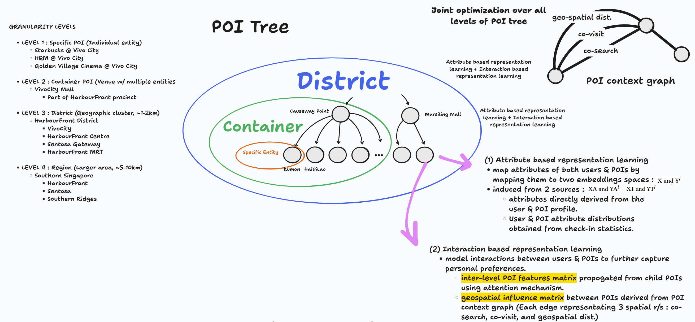
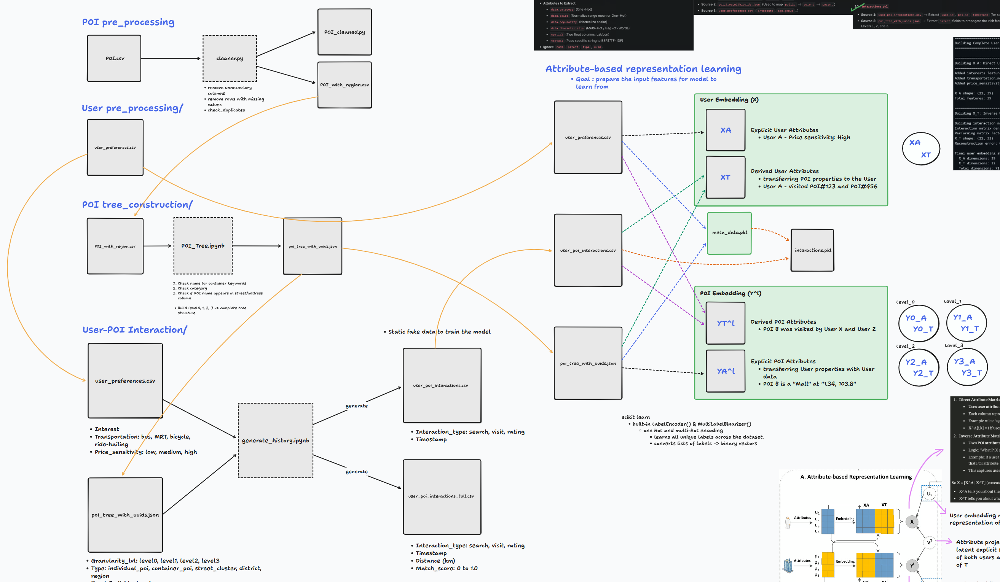

# 🗺️ SpatiaLynk

A full-stack spatial intelligence platform that generates Top-K POI recommendations at multiple spatial granularities (city 🌆 -> suburb 🏘️ -> building 🏢) enabling context-aware, hyper-local suggestions for users.

---

## 💻 Front-end Technologies
- ReactNative
- TypeScript
- Styled-components
- Expo

---

## 🖥️ Back-end Technologies (Model)
- Python
- FastAPI
- TensorFlow

---

## 🔄 The Process

### 👇 Below is the overall workflow for SpatiaLnyk

We started by grounding the project in research, referencing a spatial recommendation paper that explores hierarchical and multi-granularity POI representations. This paper helped frame how recommendations could work not just at a single level, but across cities, suburbs, and individual locations
(Reference: https://arxiv.org/pdf/2101.02969).

Next, we sourced a comprehensive Singapore POI dataset from Kaggle. Rather than using it directly, we spent time understanding the structure and limitations of the data so it could be adapted to fit the system we wanted to build
(Dataset: https://www.kaggle.com/datasets/sunnysharma432/comprehensive-singapore-poi-dataset).

From there, we generated synthetic user-related datasets, including user preferences and user–POI interaction data. This allowed me to simulate realistic behavior patterns and test how recommendations might change based on different user interests and interaction histories.

Once the user data was in place, we cleaned up the POI dataset. This involved standardizing categories, removing noisy or incomplete entries, and ensuring that spatial and semantic attributes were consistent enough to support downstream modeling.

### 👇 Below is the overview of the POI tree that we constructed

After that, we built the POI tree hierarchy. POIs were organized into a multi-level structure, starting from broad geographic regions and progressively narrowing down to specific locations. This hierarchy made it possible to generate recommendations at different spatial granularities and enabled efficient traversal, aggregation, and embedding of POIs at each level.

### 👇 Below is how the dataset and embeddings are constructed

---

## 📚 What we've Learned

---

## 💡 How can it be improved

Multi-user collaborative filtering

Itinerary day planner

---

